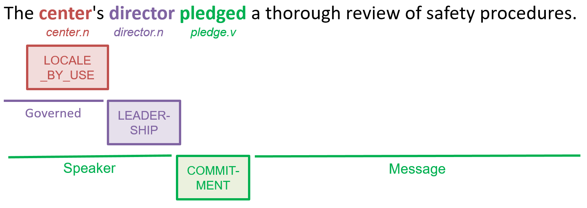
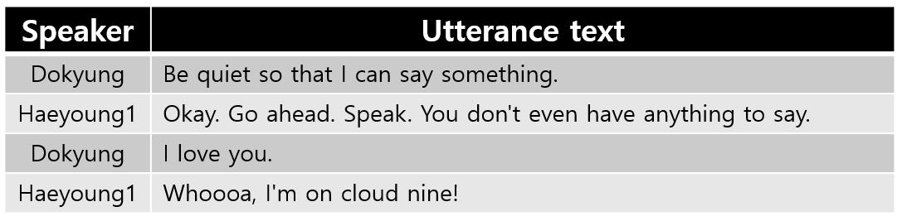

# Dialog Frame Parser: Frame-semantic parser in Dialog
 The model architecture itself is an extension of the [frameBERT](https://github.com/machinereading/frameBERT) model. 

## About
The Dialog Frame Parser is a `BERT`-based frame-semantic parser to understand the meaning of dialog in terms of [FrameNet](https://framenet.icsi.berkeley.edu/fndrupal/).

**frame** (frame semantics) is a schematic representation of a situation or an event. 
For an example sentence, "The center's director pledged a thorough review of safety precedures", frameBERT identifies several frames such as `Being_born` and `Death` for lexical units (e.g., `center.n`, `director.n` and `pledge.v`).



**dialog** is a collection of multiple utterances. An **utterance** consists of a speaker and an utterance text. 

The following is an example of a dialog.



## prerequisite
* `python 3`
* `pytorch` ([Link](https://pytorch.org/))
* `transformers` ([Link](https://github.com/huggingface/transformers/tree/9a0a8c1c6f4f2f0c80ff07d36713a3ada785eec5#installation))
* `Korean FrameNet` ([Link](https://github.com/machinereading/koreanframenet))
* `keras` ([Link](https://keras.io/#installation))

## Getting Started

### Step 1: Install

```
git clone https://github.com/machinereading/Dialog_Frame_Parser.git
```

### Step 2: Prepare the data

The sample data can be found `input_data` directory.

### Step 3: Train the model

```
python train.py
```

- You can edit `model_dir` and `data_path` in 32-33 lines in `train.py`.

### Step 4: Evaluate the model

```
python evaluate.py
```

- You can edit `model_dir` and `data_path` in 21-22 lines in `evaluate.py`.

## Licenses
* `CC BY-NC-SA` [Attribution-NonCommercial-ShareAlike](https://creativecommons.org/licenses/by-nc-sa/2.0/)
* If you want to commercialize this resource, [please contact to us](http://mrlab.kaist.ac.kr/contact)

## Publisher
[Machine Reading Lab](http://mrlab.kaist.ac.kr/) @ KAIST

## Contact
CHEOLHUN HEO. `fairy_of_9@kaist.ac.kr`

## Acknowledgement
 This work was supported by Institute for Information & communications Technology Planning & Evaluation(IITP) grant funded by the Korea government(MSIT) (No.2017-0-01780, The technology development for event recognition/relational reasoning and learning knowledge based system for video understanding) 
